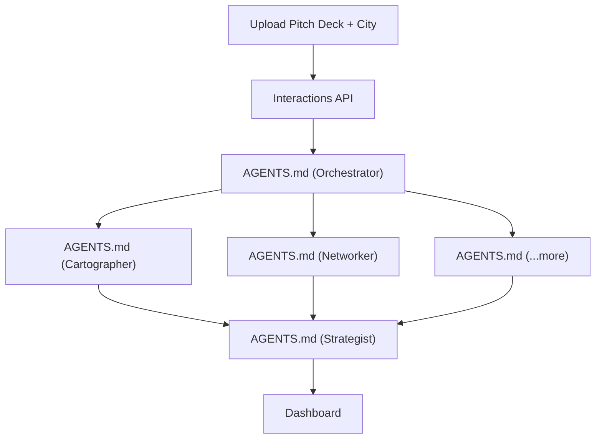
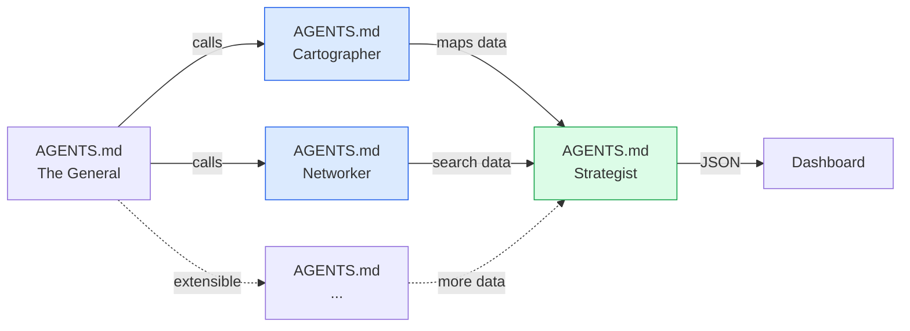

# Google AI Scout

**Expand into any city like you already know the terrain.**

  Google AI Hackathon · Gemini 3.5 Flash · Agentic Workflows

---
layout: image-left
image: /images/problem.svg
---

# The Problem: Terrain Blindness

Businesses expanding into new cities operate blind:

 

- **Competitors** — who are they, where are they?
- **Networking** — where do founders & buyers meet?
- **Culture** — what local nuances matter?
- **Partners** — which brands or people to collaborate with?

 

  Traditional research: weeks of manual work · thousands in consultant fees

---
layout: two-cols
---

# Google AI Scout

Multi-agent market expansion platform built on **Gemini Managed Agents** (<1 week old at I/O).

Upload a **pitch deck** + enter a **target city** → get a complete **Battle Plan** in ~30 seconds.

 

  "We turn terrain blindness into a 30-second Battle Plan."

 

  Gemini Managed Agents grounded in Google Maps & Search, defined as AGENTS.md files, running in isolated sandboxes.

::right::

  Gemini Managed Agents — declarative AGENTS.md files → isolated sandboxes

---
layout: two-cols
---

# How It Works

 

### Agent Pipeline

| Agent | Definition | Tool | Role |
|-------|------------|------|------|
| **The General** | `AGENTS.md` | PDF Ingest | Parse deck, decompose & orchestrate |
| **Cartographer** | `AGENTS.md` | Maps Grounding + Browse | Pin competitors, clusters, POIs |
| **Networker** | `AGENTS.md` | Search Grounding + Browse | Events, contacts, regulation |
| **Strategist** | `AGENTS.md` | Code Execution | Merge into structured Battle Plan |
| *...more agents* | `AGENTS.md` | Any grounding | Add Legal, Financial, Culture etc. |

 

  All agents are declarative AGENTS.md files · Gemini 3.5 Flash 
  Interactions API provisions isolated sandboxes — no infrastructure to run

::right::

  Gemini Managed Agents · Maps grounding · Search grounding · Code execution

---
layout: default
---

# Business Value

  
🎯

  
Who Benefits

  

    Startup founders validating expansion 
    SMB owners competing without research budgets 
    BD managers prioritizing cities & first-week actions
  

  
⚡

  
Speed

  

    Weeks of Googling 
    ~30 seconds 
    with live progress indicators
  

  
🌍

  
Democratization

  

    Consultant-grade market research 
    accessible to any business 
    Leveling the playing field
  

---
layout: default
---

# Why Gemini 3.5 Flash + Managed Agents

  
🗺️

  

    
Google Maps Grounding

    
Pin competitors, hubs, retail clusters in the target city with live map data

  

  
🔍

  

    
Google Search Grounding

    
Live events, chamber leaders, news, communities, local regulation

  

  
🧠

  

    
1M Token Context Window

    
Ingest full PDFs — pitch decks, financials, catalogs — for niche-accurate research

  

  
⚡

  

    
High Throughput (~289 tok/s)

    
Many sub-agent turns execute in parallel; dashboard fills in seconds

  

  
🆕

  

    
Gemini Managed Agents I/O 2026

    
Define agents as AGENTS.md files — Interactions API provisions isolated Linux sandboxes. Code execution, web browsing, state persistence built-in.

  

  Declarative AGENTS.md + native Maps/Search grounding + isolated sandboxes — brand new at Google I/O 2026

---
layout: center
class: text-center
---

# Live Demo

  ▶

  Let's scout Austin.

  Pitch Deck → Multi-Agent Pipeline → Battle Plan

---
layout: center
class: text-center
---

# Google AI Scout

  Terrain blindness → 30-second Battle Plan

  Google AI Hackathon · Built with Gemini 3.5 Flash · Maps ↔ Search Grounding

